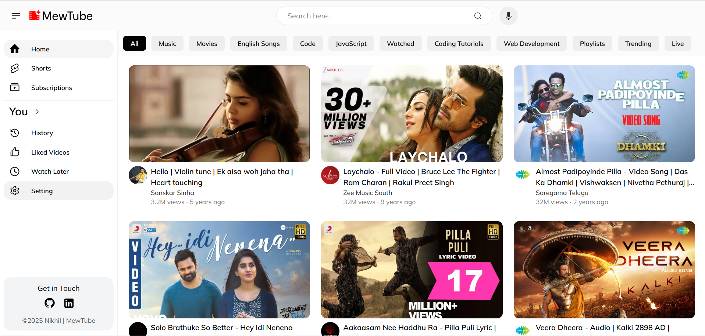

# MewTube

## 

---

## About

A personalized YouTube UI clone made for good practices and to understand concepts of API and UI.

## Tech Stack

Next.js 15 | Tailwind CSS v4 | TypeScript | @fontsource-variable  
Built with Technology and Love. ❤️

---

_Data and thumbnails sourced from YouTube. All rights belong to respective content creators._

**Copyright (c) 2025 Nikhil Katkuri.**

All rights reserved. No part of this code may be copied, modified, or distributed without explicit written permission from the author.
